# PRD - Aplikasi Manajemen Kos-Kosan
### Tugas 2 Cloud Computing - PaaS Berbasis Podman

| Item | Keterangan |
|------|-----------|
| **Mata Kuliah** | Cloud Computing |
| **Dosen Pengampu** | I Putu Hariyadi |
| **Topik Tugas** | Cloud Computing Platform as a Service Berbasis Podman |
| **Platform Lab** | Red Hat Academy - Course DO188 |
| **Mahasiswa** | M. Rizqullah |
| **Nama Panggilan** | `qullah` |
| **Tanggal** | 10 Agustus 2026 |
| **Versi Dokumen** | v3.0 (major: tambah modul manajemen keuangan - pendapatan & pengeluaran kos + laporan bulanan) |

---

## Daftar Isi

1. [Latar Belakang & Tujuan](#1-latar-belakang--tujuan)
2. [Ruang Lingkup](#2-ruang-lingkup)
3. [Stakeholder & Actor](#3-stakeholder--actor)
4. [Use Case Diagram](#4-use-case-diagram)
5. [Use Case Deskripsi](#5-use-case-deskripsi)
6. [Struktur Database](#6-struktur-database)
7. [Sequence Diagram](#7-sequence-diagram)
8. [Fitur Aplikasi](#8-fitur-aplikasi)
9. [Arsitektur Deployment (Podman Compose)](#9-arsitektur-deployment-podman-compose)
10. [Variabel Lingkungan](#10-variabel-lingkungan-database)
11. [Workflow Development](#11-workflow-development-local--git--vps)
12. [Deliverables](#12-deliverables-file-yang-akan-dibuat)
13. [Rencana Verifikasi](#13-rencana-verifikasi-soal-no-611)
14. [Panduan Screenshot per Soal](#14-panduan-screenshot-per-soal-no-1-11)
15. [Urutan Eksekusi Lengkap](#15-urutan-eksekusi-lengkap)
16. [Risiko & Asumsi](#16-risiko--asumsi)

---

## 1. Latar Belakang & Tujuan

Kebutuhan tempat tinggal sementara (kos) bagi mahasiswa dan pekerja terus meningkat, terutama di area kampus dan pusat kota. Pemilik kos sering kali masih mencatat data kos secara manual di buku atau spreadsheet, sehingga sulit untuk memantau ketersediaan kamar, harga, status kos, dan data penyewa.

**Tujuan aplikasi:** Membangun aplikasi web berbasis **PHP + MariaDB** yang dapat melakukan manajemen data kos secara digital dengan fitur lengkap: autentikasi admin, CRUD kos dengan upload foto, manajemen penyewa, dan pencarian/filter. Aplikasi dikembangkan secara **local-first** (test penuh di mesin lokal), lalu versinya dikontrol via **Git (GitHub/GitLab)**, dan dideploy ke **Lab Red Hat Academy (DO188)** untuk verifikasi & submission menggunakan arsitektur multi-container **Podman Compose**.

---

## 2. Ruang Lingkup (Scope)

> **Catatan strategis:** Scope dibagi 2 lapis. **Lapis A** = requirement wajib dosen (11 ketentuan). **Lapis B** = fitur tambahan untuk menjadikan aplikasi lebih lengkap & realistis. Keduanya diimplementasikan sekaligus karena lapis B tidak mengganggu lapis A.

### Lapis A - Requirement Dosen (wajib untuk penilaian)

| Soal | Requirement | Lapis |
|------|------------|-------|
| 1 | Aplikasi web CRUD PHP + MariaDB | A |
| 2 | File SQL (DDL + DML min 2 record) | A |
| 3 | php-apache.Containerfile (ext mysqli + nano) | A |
| 4 | mariadb.Containerfile (auto-import SQL) | A |
| 5 | compose.yml (3 services + volume + depends_on) | A |
| 6-11 | Build, verifikasi, CRUD test, stop | A |

### Lapis B - Fitur Tambahan (expand scope)

| Kode | Fitur | Tujuan |
|------|-------|-------|
| B1 | **Login & Autentikasi Admin** | Halaman login (username + password hash), session, proteksi halaman admin. Mencegah siapa pun mengubah data tanpa login. |
| B2 | **Pencarian & Filter Kos** | Search box + filter (tipe, status, range harga) + sort di homepage. Memudahkan mencari kos di daftar panjang. |
| B3 | **Upload Foto Kos** | Upload 1 foto per kos saat create/edit. Foto disimpan di folder server, path disimpan di DB. Tampilkan foto di detail & daftar kos. |
| B4 | **Manajemen Penyewa/Penghuni** | CRUD data penyewa + relasi ke kos (foreign key). Catat: nama, no HP, kos yang ditempati, tanggal masuk, status sewa. |
| B5 | **Manajemen Keuangan Kos** | CRUD pendapatan & pengeluaran per kos + laporan keuangan bulanan (total masuk, total keluar, saldo, breakdown per kategori). Memungkinkan pemilik kos melihat profitabilitas per kos. |

### Tidak Termasuk (Out-of-Scope)

- **Invoice/tagihan otomatis** per penyewa bulanan (butuh scheduler & status lunas tracking, di luar scope v3.0)
- Integrasi payment gateway (midtrans, transfer bank automation)
- Notifikasi email/SMS
- Mobile app native
- Multi-tenant (banyak pemilik kos dalam 1 sistem)
- Booking kalender real-time
- Laporan pajak / e-faktur

---

## 3. Stakeholder & Actor

### 3.1 Stakeholder

| Stakeholder | Kepentingan |
|-------------|------------|
| Dosen (Pak Putu Hariyadi) | Menilai pemenuhan 11 ketentuan soal Tugas 2 |
| Asisten Lab RHA | Memastikan praktik Podman sesuai course DO188 |
| Mahasiswa (M. Rizqullah) | Menyelesaikan tugas + membangun aplikasi profesional |
| Pemilik Kos (end-user bayangan) | Mengelola kos & penyewa, melihat laporan ketersediaan & **laporan keuangan bulanan (pendapatan, pengeluaran, saldo)** |
| Penyewa (calon penghuni) | Mencari kos tersedia (view-only, public access) |

### 3.2 Actor Sistem

| Actor | Tipe | Akses | Deskripsi |
|-------|------|-------|-----------|
| **Admin Kos** | Primary Human (terautentikasi) | Full CRUD + manajemen penyewa | Pengelola kos yang login. Bisa: tambah/edit/hapus kos, upload foto, kelola penyewa, lihat semua data. |
| **Tamu (Guest)** | Primary Human (tanpa login) | View-only | Pengunjung yang hanya bisa melihat daftar kos tersedia + cari/filter. Tidak bisa edit. |
| **Browser (Web Client)** | Secondary Actor | - | Client HTTP yang mengirim request ke service php-apache-qullah. |
| **MariaDB Server** | Secondary Actor (internal) | - | Service mariadb-qullah, menyimpan 3 tabel: kos, penyewa, admin. |
| **phpMyAdmin** | Supporting Service | - | GUI untuk inspeksi DB (dipakai saat verifikasi Soal no. 8). |
| **Git Remote (GitHub/GitLab)** | Infrastructure Actor | - | Repository yang menyimpan versi kode, jembatan antara local & Lab RHA. |
| **Podman Engine** | Infrastructure Actor | - | Runtime container di Lab RHA yang menjalankan 3 service. |

### 3.3 Sistem Boundary

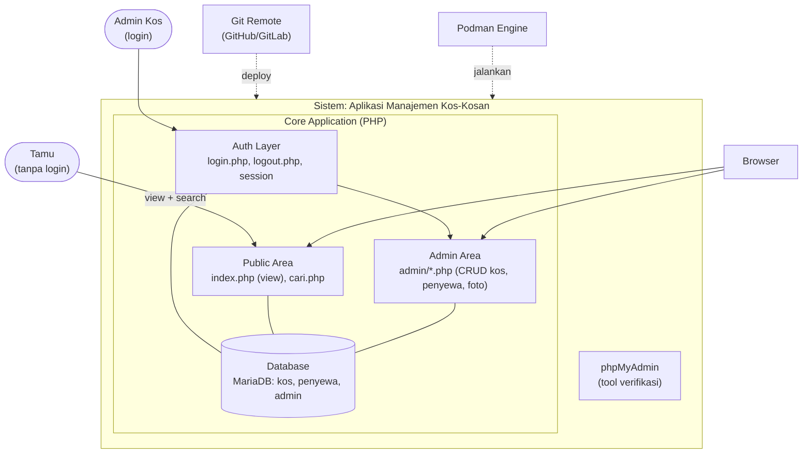

---

## 4. Use Case Diagram

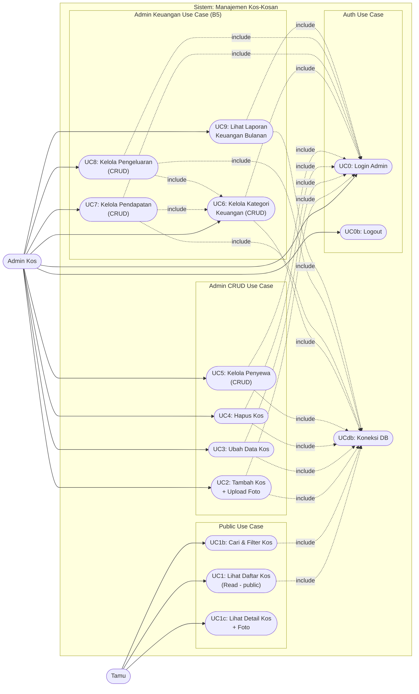

**Relasi use case:**
- Semua UC yang akses DB `<<include>>` UCdb (Koneksi Database).
- UC2-UC9 (admin CRUD + keuangan) `<<include>>` UC0 (Login) - proteksi autentikasi.
- UC7 (Pendapatan) & UC8 (Pengeluaran) `<<include>>` UC6 (Kategori) - butuh master kategori sebagai dropdown.
- Tamu hanya bisa UC1/UC1b/UC1c (view-only), tidak perlu login.

---

## 5. Use Case Deskripsi

### UC1: Lihat Daftar Kos (Read - public) - Soal no. 9

| Atribut | Detail |
|---------|--------|
| **Actor** | Tamu / Admin |
| **Pre-condition** | Container running, ada minimal 1 record |
| **Trigger** | Buka `http://<host>:8000/` |
| **Flow Utama** | 1. GET `/index.php`<br/>2. `SELECT * FROM kos ORDER BY id DESC` (query SEKALI)<br/>3. Render **2 view** di HTML yang sama:<br/>&nbsp;&nbsp;&nbsp;&nbsp;a. **Table view [DEFAULT]** — tabel HTML lengkap menampilkan **SEMUA 9 kolom**: id, nama_kos, alamat, tipe_kamar, harga_per_bulan, jumlah_kamar, status, foto (thumbnail), created_at<br/>&nbsp;&nbsp;&nbsp;&nbsp;b. **Card view [hidden]** — grid kartu kos (foto besar + nama + harga + status + tombol detail)<br/>4. Tombol toggle [Table View] / [Card View] ganti CSS class via JavaScript (client-side, tanpa reload)<br/>5. Tampilkan search box + filter (B2) di atas view |
| **Default View** | **Table view** — saat homepage pertama dibuka, LANGSUNG tampil tabel 9 kolom (memenuhi Soal 9: "seluruh data tabel"). Card view hanya muncul setelah user klik toggle. |
| **Handling Kolom Khusus** | - Kolom `alamat` (TEXT): truncate ~50 karakter + ellipsis (...), tooltip hover untuk lihat alamat lengkap<br/>- Kolom `foto`: thumbnail kecil (~50x50px) di cell; jika NULL pakai `uploads/default.jpg`<br/>- Kolom `id` & `created_at`: tampilkan apa adanya (audit/traceability) |
| **Pemenuhan Soal 9** | Default table view 9 kolom = konsisten dengan phpMyAdmin Browse tabel kos (Soal 8). Dosen bisa cross-check data phpMyAdmin = data homepage. |
| **Post-condition** | Homepage menampilkan **seluruh data kos** (semua row + semua kolom) dalam mode tabel default (wajib untuk Soal 9) |

### UC1b: Cari & Filter Kos (B2)

| Atribut | Detail |
|---------|--------|
| **Actor** | Tamu / Admin |
| **Flow Utama** | 1. User isi keyword / pilih filter (tipe, status, range harga)<br/>2. GET `/index.php?q=...&tipe=...&status=...&min=...&max=...`<br/>3. Query dinamis dengan WHERE clause<br>4. Tampilkan hasil terfilter (berlaku untuk kedua view: table & card) |

### UC1c: Lihat Detail Kos + Daftar Penyewa (B3 + nilai tambah JOIN)

| Atribut | Detail |
|---------|--------|
| **Actor** | Tamu / Admin |
| **Pre-condition** | Kos dengan id=X ada di database |
| **Trigger** | Klik nama kos / tombol "Detail" di homepage |
| **Flow Utama** | 1. GET `/detail.php?id=X`<br/>2. `SELECT * FROM kos WHERE id=X` → tampilkan info lengkap kos (semua 9 field + foto besar)<br/>3. **JOIN query (nilai tambah):** `SELECT * FROM penyewa WHERE kos_id=X ORDER BY tgl_masuk DESC` → tampilkan daftar penyewa yang menempati kos ini (nama, no_hp, tgl_masuk, status_sewa)<br/>4. Tampilkan: foto besar kos + semua info kos + tabel/kartu daftar penyewa |
| **Tujuan JOIN** | Memperlihatkan pemahaman relasi FK 1:N (satu kos : banyak penyewa). Saat demo, dosen bisa lihat "Kos Melati Jaya ditempati oleh: Andi Pratama" — bukti relasi tabel bekerja. |
| **Edge Case** | Jika kos tidak punya penyewa → tampilkan pesan "Belum ada penyewa di kos ini" |

### UC0: Login Admin (B1)

| Atribut | Detail |
|---------|--------|
| **Actor** | Admin |
| **Flow Utama** | 1. GET `/login.php`<br/>2. User input username + password<br/>3. POST -> verify hash password vs tabel `admin`<br/>4. Jika valid: set `$_SESSION['admin'] = true`<br/>5. Redirect ke `admin/dashboard.php` |
| **Alternative** | Password salah -> tampilkan error, tetap di login page |

### UC2: Tambah Kos + Upload Foto (Create) - Soal no. 10

| Atribut | Detail |
|---------|--------|
| **Actor** | Admin (wajib login) |
| **Flow Utama** | 1. GET `/admin/tambah_kos.php` (cek session)<br/>2. Form: nama, alamat, tipe, harga, jumlah, status + input file foto<br/>3. POST -> validasi + upload foto ke `/uploads/`<br/>4. `INSERT INTO kos (..., foto) VALUES (...)`<br/>5. Redirect ke dashboard |
| **Catatan** | Upload foto opsional - jika tidak ada, pakai placeholder default |

### UC3: Ubah Data Kos (Update) - Soal no. 10

Sama seperti UC2 tapi `SELECT ... WHERE id=X` untuk pre-fill form, lalu `UPDATE`. Foto lama bisa diganti.

### UC4: Hapus Data Kos (Delete) - Soal no. 10

| Atribut | Detail |
|---------|--------|
| **Flow Utama** | 1. Klik Hapus -> JS `confirm()`<br/>2. GET `/admin/hapus_kos.php?id=X`<br/>3. **Pre-check (BR-4):** `SELECT COUNT(*) FROM penyewa WHERE kos_id=X`<br/>4. **Jika count = 0:** hapus file foto dari `/uploads/` (jika ada) -> `DELETE FROM kos WHERE id=X` -> redirect dengan flash message "Kos berhasil dihapus"<br/>5. **Jika count > 0:** TOLAK hapus -> redirect kembali dengan pesan *"Tidak bisa menghapus kos ini karena masih ada N penyewa. Hapus/pindahkan penyewa terlebih dahulu."* |
| **Catatan** | Strategi RESTRICT (bukan CASCADE) untuk keamanan data. FK di SQL pakai `ON DELETE RESTRICT` (default MariaDB) sebagai safety net jika PHP pre-check dilewati. |

### UC5: Kelola Penyewa (CRUD) - B4

| Atribut | Detail |
|---------|--------|
| **Actor** | Admin (wajib login) |
| **Flow Utama** | CRUD standar pada tabel `penyewa` (nama, no_hp, kos_id FK, tgl_masuk, status). Form select kos dari dropdown (relasi FK). |

### UC6: Kelola Kategori Keuangan (CRUD) - B5

| Atribut | Detail |
|---------|--------|
| **Actor** | Admin (wajib login) |
| **Flow Utama** | CRUD pada tabel `kategori` (nama, tipe ENUM('Pendapatan','Pengeluaran')). Dipakai sebagai master data yang direferensikan oleh pendapatan & pengeluaran via FK. Saat input transaksi, dropdown kategori difilter berdasarkan tipe. |
| **Catatan** | Tabel di-seed default saat init: Pendapatan (Sewa, Deposit, Denda), Pengeluaran (Listrik, Air, Internet, Sampah, Perbaikan, Gaji, Lainnya). User bisa tambah/hapus kategori custom. |

### UC7: Kelola Pendapatan (CRUD) - B5

| Atribut | Detail |
|---------|--------|
| **Actor** | Admin (wajib login) |
| **Pre-condition** | Minimal 1 kos dan 1 kategori tipe 'Pendapatan' ada di DB |
| **Flow Utama** | CRUD pada tabel `pendapatan`. Form: pilih kos (dropdown), pilih kategori (dropdown filter tipe='Pendapatan'), tanggal, jumlah (Rp), keterangan (opsional). |
| **Catatan** | Jumlah wajib > 0 (BR-8). Tanggal default = hari ini. |

### UC8: Kelola Pengeluaran (CRUD) - B5

| Atribut | Detail |
|---------|--------|
| **Actor** | Admin (wajib login) |
| **Pre-condition** | Minimal 1 kos dan 1 kategori tipe 'Pengeluaran' ada di DB |
| **Flow Utama** | CRUD pada tabel `pengeluaran`. Form sama seperti UC7 tapi kategori filter tipe='Pengeluaran'. |
| **Catatan** | Jumlah wajib > 0 (BR-8). Tanggal default = hari ini. |

### UC9: Lihat Laporan Keuangan Bulanan - B5

| Atribut | Detail |
|---------|--------|
| **Actor** | Admin (wajib login) |
| **Trigger** | Buka `admin/laporan.php` |
| **Flow Utama** | 1. GET `admin/laporan.php?bulan=08&tahun=2026`<br/>2. Query agregasi dengan filter periode bulan/tahun:<br/>&nbsp;&nbsp;&nbsp;&nbsp;- `SELECT COALESCE(SUM(jumlah),0) FROM pendapatan WHERE MONTH(tanggal)=? AND YEAR(tanggal)=?`<br/>&nbsp;&nbsp;&nbsp;&nbsp;- `SELECT COALESCE(SUM(jumlah),0) FROM pengeluaran WHERE MONTH(tanggal)=? AND YEAR(tanggal)=?`<br/>3. Hitung saldo = pendapatan - pengeluaran<br/>4. Breakdown per kategori: `SELECT k.nama, SUM(t.jumlah) FROM pendapatan t JOIN kategori k ON t.kategori_id=k.id WHERE ... GROUP BY k.id`<br/>5. Tampilkan: ringkasan (3 stat card: masuk, keluar, saldo) + tabel breakdown per kategori + grafik sederhana (opsional, pakai Chart.js via CDN) |
| **Filter** | Dropdown bulan (1-12) + tahun (2025, 2026, 2027). Default = bulan/tahun saat ini. |
| **Edge Case** | Jika tidak ada transaksi di bulan tsb → tampil "Belum ada transaksi pada periode ini" + stat card semua 0. |

---

## 6. Struktur Database

### 6.1 Entity Relationship Diagram (ERD)

Sekarang ada **6 entitas** dengan relasi (admin, kos, penyewa, kategori, pendapatan, pengeluaran):

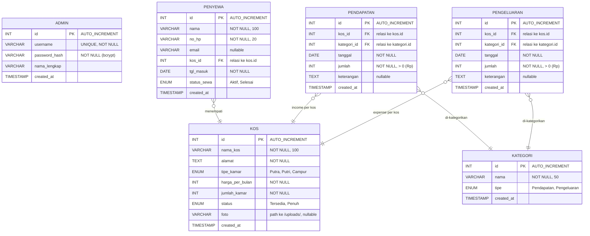

**Kardinalitas:**
- `KOS : PENYEWA = 1 : N` - satu kos bisa ditempati banyak penyewa.
- `KOS : PENDAPATAN = 1 : N` - satu kos bisa punya banyak transaksi pendapatan.
- `KOS : PENGELUARAN = 1 : N` - satu kos bisa punya banyak transaksi pengeluaran.
- `KATEGORI : PENDAPATAN = 1 : N` - satu kategori dipakai banyak transaksi pendapatan.
- `KATEGORI : PENGELUARAN = 1 : N` - satu kategori dipakai banyak transaksi pengeluaran.
- `ADMIN` berdiri sendiri (tidak berelasi, hanya untuk autentikasi).

### 6.2 Deskripsi Detail Tabel

#### Tabel `kos` (entitas utama - wajib untuk Soal 2)

| # | Kolom | Tipe | Constraint | Wajib? | Default | Deskripsi |
|---|-------|------|-----------|--------|---------|-----------|
| 1 | `id` | INT | PK, AUTO_INCREMENT | auto | 1 | Primary key |
| 2 | `nama_kos` | VARCHAR(100) | NOT NULL | Ya | - | Nama kos |
| 3 | `alamat` | TEXT | NOT NULL | Ya | - | Alamat lengkap |
| 4 | `tipe_kamar` | ENUM('Putra','Putri','Campur') | NOT NULL | Ya | - | Tipe kos |
| 5 | `harga_per_bulan` | INT | NOT NULL | Ya | - | Harga sewa (Rp) |
| 6 | `jumlah_kamar` | INT | NOT NULL | Ya | - | Total kamar |
| 7 | `status` | ENUM('Tersedia','Penuh') | - | Tidak | 'Tersedia' | Ketersediaan |
| 8 | `foto` | VARCHAR(255) | - | Tidak | NULL | Path foto (B3) |
| 9 | `created_at` | TIMESTAMP | - | Tidak | NOW() | Audit |

#### Tabel `penyewa` (B4 - manajemen penyewa)

| # | Kolom | Tipe | Constraint | Wajib? | Default | Deskripsi |
|---|-------|------|-----------|--------|---------|-----------|
| 1 | `id` | INT | PK, AUTO_INCREMENT | auto | 1 | Primary key |
| 2 | `nama` | VARCHAR(100) | NOT NULL | Ya | - | Nama penyewa |
| 3 | `no_hp` | VARCHAR(20) | NOT NULL | Ya | - | Nomor HP |
| 4 | `email` | VARCHAR(100) | - | Tidak | NULL | Email (opsional) |
| 5 | `kos_id` | INT | FK -> kos.id | Ya | - | Kos yang ditempati |
| 6 | `tgl_masuk` | DATE | NOT NULL | Ya | - | Tanggal masuk |
| 7 | `status_sewa` | ENUM('Aktif','Selesai') | - | Tidak | 'Aktif' | Status sewa |
| 8 | `created_at` | TIMESTAMP | - | Tidak | NOW() | Audit |

#### Tabel `admin` (B1 - autentikasi)

| # | Kolom | Tipe | Constraint | Wajib? | Default | Deskripsi |
|---|-------|------|-----------|--------|---------|-----------|
| 1 | `id` | INT | PK, AUTO_INCREMENT | auto | 1 | Primary key |
| 2 | `username` | VARCHAR(50) | UNIQUE, NOT NULL | Ya | - | Username login |
| 3 | `password_hash` | VARCHAR(255) | NOT NULL | Ya | - | Hash bcrypt |
| 4 | `nama_lengkap` | VARCHAR(100) | - | Tidak | NULL | Nama admin |
| 5 | `created_at` | TIMESTAMP | - | Tidak | NOW() | Audit |

#### Tabel `kategori` (B5 - master data keuangan)

| # | Kolom | Tipe | Constraint | Wajib? | Default | Deskripsi |
|---|-------|------|-----------|--------|---------|-----------|
| 1 | `id` | INT | PK, AUTO_INCREMENT | auto | 1 | Primary key |
| 2 | `nama` | VARCHAR(50) | NOT NULL | Ya | - | Nama kategori (mis. "Sewa", "Listrik") |
| 3 | `tipe` | ENUM('Pendapatan','Pengeluaran') | NOT NULL | Ya | - | Klasifikasi kategori |
| 4 | `created_at` | TIMESTAMP | - | Tidak | NOW() | Audit |

#### Tabel `pendapatan` (B5 - uang masuk per kos)

| # | Kolom | Tipe | Constraint | Wajib? | Default | Deskripsi |
|---|-------|------|-----------|--------|---------|-----------|
| 1 | `id` | INT | PK, AUTO_INCREMENT | auto | 1 | Primary key |
| 2 | `kos_id` | INT | FK -> kos.id | Ya | - | Kos terkait |
| 3 | `kategori_id` | INT | FK -> kategori.id | Ya | - | Kategori pendapatan (mis. Sewa) |
| 4 | `tanggal` | DATE | NOT NULL | Ya | - | Tanggal transaksi |
| 5 | `jumlah` | INT | NOT NULL, > 0 | Ya | - | Nominal dalam Rupiah |
| 6 | `keterangan` | TEXT | - | Tidak | NULL | Catatan tambahan |
| 7 | `created_at` | TIMESTAMP | - | Tidak | NOW() | Audit |

#### Tabel `pengeluaran` (B5 - uang keluar per kos)

| # | Kolom | Tipe | Constraint | Wajib? | Default | Deskripsi |
|---|-------|------|-----------|--------|---------|-----------|
| 1 | `id` | INT | PK, AUTO_INCREMENT | auto | 1 | Primary key |
| 2 | `kos_id` | INT | FK -> kos.id | Ya | - | Kos terkait |
| 3 | `kategori_id` | INT | FK -> kategori.id | Ya | - | Kategori pengeluaran (mis. Listrik) |
| 4 | `tanggal` | DATE | NOT NULL | Ya | - | Tanggal transaksi |
| 5 | `jumlah` | INT | NOT NULL, > 0 | Ya | - | Nominal dalam Rupiah |
| 6 | `keterangan` | TEXT | - | Tidak | NULL | Catatan tambahan |
| 7 | `created_at` | TIMESTAMP | - | Tidak | NOW() | Audit |

### 6.3 Aturan Bisnis (Business Rules)

| Aturan | Implementasi |
|--------|-------------|
| BR-1: Hanya admin yang login bisa CRUD | Cek `$_SESSION['admin']` di awal tiap file `/admin/*.php` |
| BR-2: Password disimpan sebagai hash (bukan plaintext) | `password_hash($pass, PASSWORD_BCRYPT)` saat insert |
| BR-3: Upload foto maksimal 2MB, format JPG/PNG | Validasi `$_FILES['foto']['size']` + extension |
| BR-4: Hapus kos yang masih ada penyewanya -> TOLAK dengan pesan ramah | FK `ON DELETE RESTRICT` (default MariaDB) di skema SQL + pre-check di `hapus_kos.php`: `SELECT COUNT(*) FROM penyewa WHERE kos_id=?`; jika > 0 tampilkan *"Tidak bisa menghapus kos ini karena masih ada N penyewa. Hapus/pindahkan penyewa terlebih dahulu."*; jika = 0 lanjut DELETE + hapus file foto dari filesystem |
| BR-5: Pencarian case-insensitive | Query `LIKE '%keyword%'` |
| BR-6: Harga & jumlah kamar harus > 0 | Validasi `is_numeric() && > 0` di PHP |
| BR-7: Hapus data tidak bisa di-undo | `confirm()` JS sebelum DELETE |
| BR-8: Jumlah transaksi (pendapatan/pengeluaran) harus > 0 | Validasi `is_numeric() && > 0` di PHP (sama seperti BR-6 untuk harga kos) |
| BR-9: Hapus kategori yang masih dipakai transaksi -> TOLAK | Pre-check: `SELECT COUNT(*) FROM pendapatan WHERE kategori_id=X` + `SELECT COUNT(*) FROM pengeluaran WHERE kategori_id=X`. Jika > 0 → tolak dengan pesan "Kategori ini masih dipakai N transaksi. Hapus/ubah transaksi tersebut dulu." |

### 6.4 Data Awal (Seed - minimal 2 record sesuai Soal 2)

**Tabel `kos` (2 record):**

| id | nama_kos | alamat | tipe | harga | jumlah | status | foto |
|----|----------|--------|------|-------|--------|--------|------|
| 1 | Kos Melati Jaya | Jl. Merdeka No.5, Mataram | Putri | 500000 | 10 | Tersedia | NULL |
| 2 | Kos Sentosa Abadi | Jl. Diponegoro No.12, Cakranegara | Putra | 450000 | 8 | Tersedia | NULL |

**Tabel `penyewa` (2 record - FK menyebar ke 2 kos berbeda agar relasi 1:N terlihat jelas):**

| id | nama | no_hp | email | kos_id | tgl_masuk | status |
|----|------|-------|-------|--------|-----------|--------|
| 1 | Andi Pratama | 081234567890 | andi@email.com | 1 | 2026-07-01 | Aktif |
| 2 | Siti Rahmawati | 082198765432 | siti@email.com | 2 | 2026-06-15 | Aktif |

**Tabel `admin` (1 record):**

| username | password (plaintext input) | password_hash di DB |
|----------|---------------------------|---------------------|
| admin | admin123 | `$2y$10$...` (bcrypt hash dari admin123) |

**Tabel `kategori` (10 record - seed default, user bisa tambah/hapus via UI):**

| id | nama | tipe |
|----|------|------|
| 1 | Sewa | Pendapatan |
| 2 | Deposit | Pendapatan |
| 3 | Denda | Pendapatan |
| 4 | Listrik | Pengeluaran |
| 5 | Air | Pengeluaran |
| 6 | Internet | Pengeluaran |
| 7 | Sampah | Pengeluaran |
| 8 | Perbaikan | Pengeluaran |
| 9 | Gaji | Pengeluaran |
| 10 | Lainnya | Pengeluaran |

**Tabel `pendapatan` (2 record contoh - uang masuk):**

| id | kos_id | kategori_id | tanggal | jumlah | keterangan |
|----|--------|-------------|---------|--------|-----------|
| 1 | 1 | 1 (Sewa) | 2026-08-01 | 500000 | Sewa Andi bulan Agustus |
| 2 | 2 | 1 (Sewa) | 2026-08-03 | 450000 | Sewa Siti bulan Agustus |

**Tabel `pengeluaran` (2 record contoh - uang keluar):**

| id | kos_id | kategori_id | tanggal | jumlah | keterangan |
|----|--------|-------------|---------|--------|-----------|
| 1 | 1 | 4 (Listrik) | 2026-08-05 | 150000 | Bayar listrik Kos Melati |
| 2 | 2 | 5 (Air) | 2026-08-07 | 80000 | Bayar PDAM Kos Sentosa |

---

## 7. Sequence Diagram

### 7.1 Sequence: Lihat Daftar Kos + Cari/Filter (UC1 + UC1b)

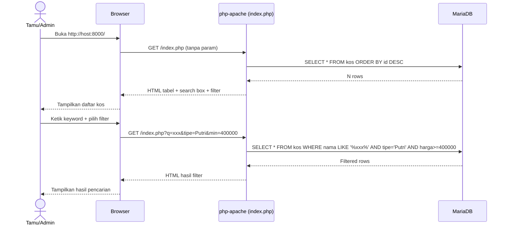

### 7.2 Sequence: Login Admin (UC0)

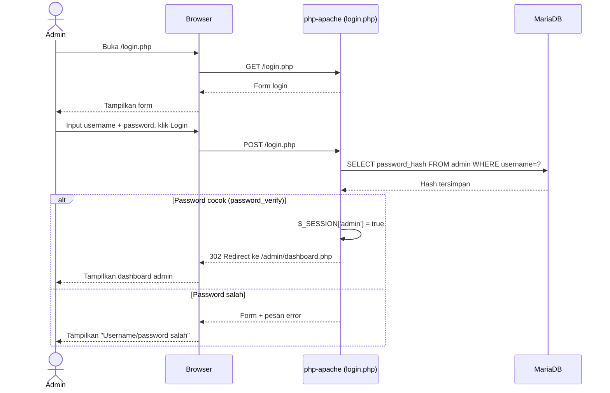

### 7.3 Sequence: Tambah Kos + Upload Foto (UC2)

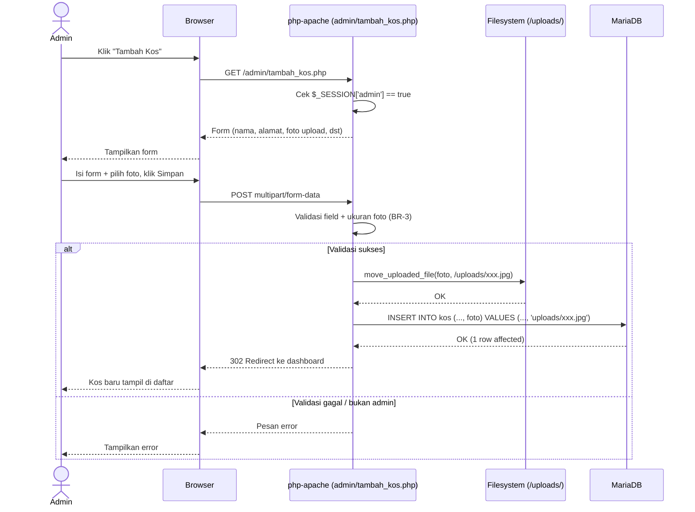

### 7.4 Sequence: Update & Delete (UC3, UC4)

Alur mirip dengan 7.3 (dengan session check). Update: SELECT pre-fill -> UPDATE. Delete: JS confirm -> DELETE (opsional hapus foto dari filesystem).

### 7.5 Sequence: Kelola Penyewa (UC5)

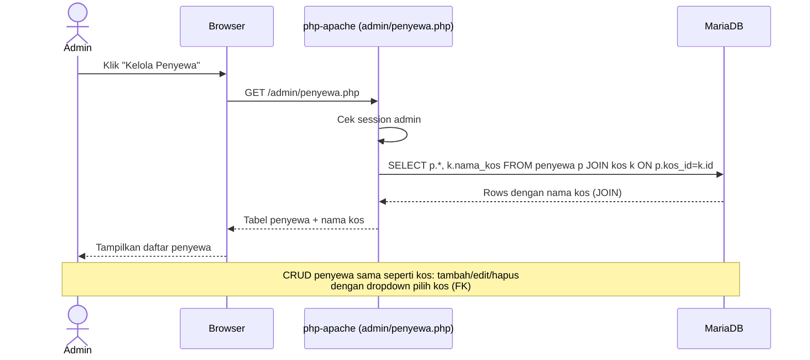

### 7.6 Sequence: Startup Container (Soal 6)

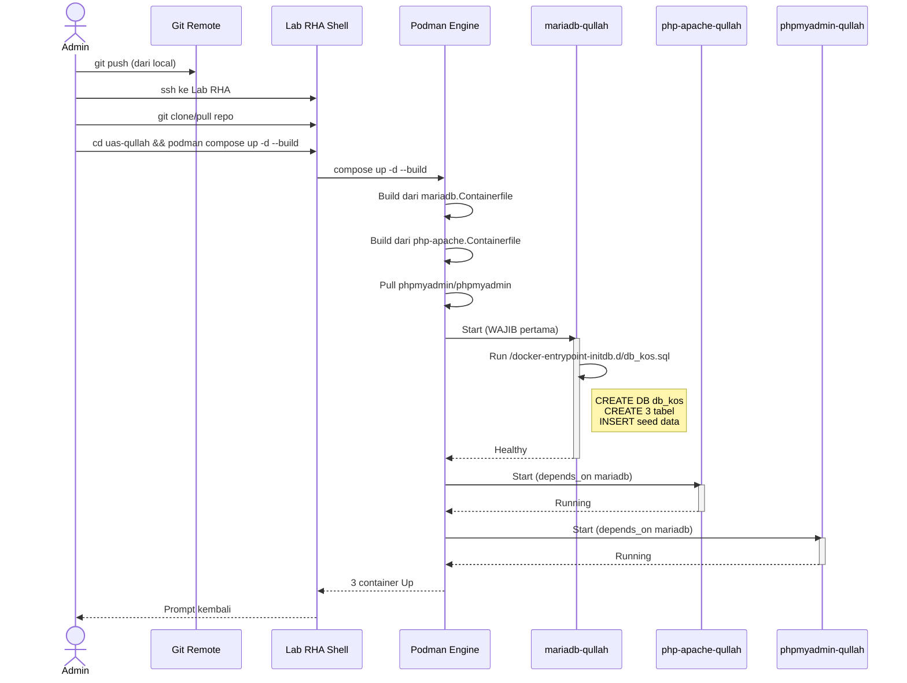

### 7.7 Sequence: Input Pendapatan/Pengeluaran (UC7 / UC8)

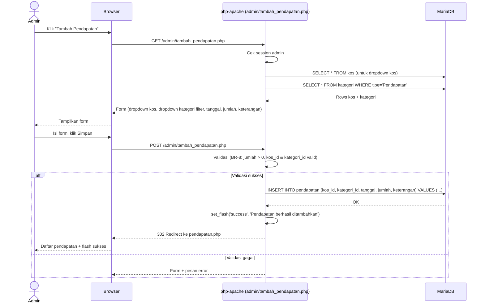

### 7.8 Sequence: Lihat Laporan Keuangan Bulanan (UC9)

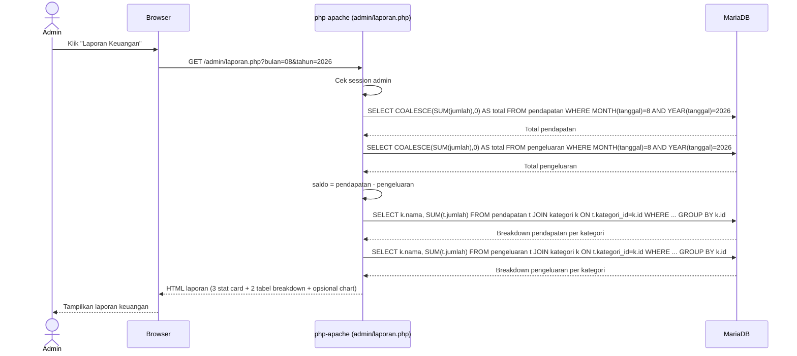

---

## 8. Fitur Aplikasi

### 8.1 Mapping Fitur ke File

| Fitur | Kode | File PHP | Akses |
|-------|------|----------|-------|
| Homepage (Read - public) | A/UC1 | `index.php` | Public |
| Pencarian & Filter | B2/UC1b | `index.php` (query param) | Public |
| Detail Kos + Foto | B3/UC1c | `detail.php?id=X` | Public |
| Login Admin | B1/UC0 | `login.php` | Public |
| Logout | B1/UC0b | `logout.php` | Admin |
| Dashboard Admin | B1 | `admin/dashboard.php` | Admin |
| CRUD Kos | A/UC2-4 | `admin/tambah_kos.php`, `admin/edit_kos.php`, `admin/hapus_kos.php` | Admin |
| CRUD Penyewa | B4/UC5 | `admin/penyewa.php`, `admin/tambah_penyewa.php`, `admin/edit_penyewa.php`, `admin/hapus_penyewa.php` | Admin |
| CRUD Kategori Keuangan | B5/UC6 | `admin/kategori.php`, `admin/tambah_kategori.php`, `admin/edit_kategori.php`, `admin/hapus_kategori.php` | Admin |
| CRUD Pendapatan | B5/UC7 | `admin/pendapatan.php`, `admin/tambah_pendapatan.php`, `admin/edit_pendapatan.php`, `admin/hapus_pendapatan.php` | Admin |
| CRUD Pengeluaran | B5/UC8 | `admin/pengeluaran.php`, `admin/tambah_pengeluaran.php`, `admin/edit_pengeluaran.php`, `admin/hapus_pengeluaran.php` | Admin |
| Laporan Keuangan Bulanan | B5/UC9 | `admin/laporan.php?bulan=&tahun=` | Admin |
| Koneksi DB | - | `koneksi.php` | Internal |
| Helper auth | B1 | `auth.php` (cek session) | Internal |
| Helper flash message | - | `flash.php` (set_flash + show_flash) | Internal |

### 8.2 Struktur Folder Final

```
uas-qullah/
+-- PRD_Manajemen_Kos_Kosan.md
+-- db_kos.sql
+-- php-apache.Containerfile
+-- mariadb.Containerfile
+-- compose.yml
+-- README.md
+-- .gitignore
+-- www/
    +-- index.php              (homepage + search/filter - public)
    +-- detail.php             (detail kos + foto - public)
    +-- login.php              (form login)
    +-- logout.php
    +-- koneksi.php
    +-- auth.php               (helper cek session)
    +-- flash.php              (helper flash message - sukses/error)
    +-- style.css
    +-- uploads/               (folder upload foto kos)
    |   +-- default.jpg        (placeholder)
    +-- admin/                 (area terproteksi - wajib login)
        +-- dashboard.php      (stat: total kos, penyewa, pendapatan/pengeluaran bulan ini, saldo)
        +-- tambah_kos.php
        +-- edit_kos.php
        +-- hapus_kos.php
        +-- penyewa.php
        +-- tambah_penyewa.php
        +-- edit_penyewa.php
        +-- hapus_penyewa.php
        +-- kategori.php       (B5: daftar kategori keuangan)
        +-- tambah_kategori.php
        +-- edit_kategori.php
        +-- hapus_kategori.php
        +-- pendapatan.php     (B5: daftar pendapatan + filter bulan)
        +-- tambah_pendapatan.php
        +-- edit_pendapatan.php
        +-- hapus_pendapatan.php
        +-- pengeluaran.php    (B5: daftar pengeluaran + filter bulan)
        +-- tambah_pengeluaran.php
        +-- edit_pengeluaran.php
        +-- hapus_pengeluaran.php
        +-- laporan.php        (B5: laporan keuangan bulanan + breakdown kategori)
```

### 8.3 Panduan Styling (Bootstrap 5 - Profesional)

**Framework:** Bootstrap 5 via CDN (tidak ada build step, edit-refresh langsung jalan).

**Include di `<head>` semua halaman:**
```html
<link href="https://cdn.jsdelivr.net/npm/bootstrap@5.3.3/dist/css/bootstrap.min.css" rel="stylesheet">
<link href="/style.css" rel="stylesheet">
```
**Include sebelum `</body>` (untuk komponen interaktif: modal, dropdown, collapse):**
```html
<script src="https://cdn.jsdelivr.net/npm/bootstrap@5.3.3/dist/js/bootstrap.bundle.min.js"></script>
```

#### Iron Rules (Wajib Dipatuhi)

| Aturan | Detail |
|--------|--------|
| **NO EMOJI di UI** | Dilarang emoji dekoratif (icon rumah/kunci/kamera, dll). Pakai **Bootstrap Icons** (`<i class="bi bi-house"></i>`) atau **SVG inline** untuk ikon. Emoji dianggap tidak profesional untuk tugas kuliah. |
| **Konsistensi navbar** | Navbar sama di SEMUA halaman (public + admin). Brand: "Kos Qullah" di kiri. Menu: Home, (Login/Logout), (Admin area kalau login). |
| **Format mata uang** | Harga tampil `Rp 500.000` (pakai `number_format($harga, 0, ',', '.')`). JANGAN tampil `500000` mentah. |
| **Format tanggal** | `created_at` & `tgl_masuk` tampil `10 Agu 2026` atau `2026-08-10` (tidak mentah timestamp). |
| **Flash message** | Setiap operasi CRUD (create/update/delete) tampilkan Bootstrap alert: sukses (`alert-success`), error (`alert-danger`). Hilang otomatis atau ada tombol close. |
| **Konfirmasi hapus** | Pakai `confirm()` JS atau Bootstrap modal. JANGAN langsung DELETE tanpa konfirmasi. |

#### Color Palette (Netral + 1 Aksen)

> Tujuan: tampilan profesional, bukan "tutorial". Hindari biru cerah default Bootstrap.

| Token | Warna | Penggunaan |
|-------|-------|------------|
| `--primary` (aksen) | `#0f5132` (hijau gelap) atau `#1d3557` (navy) | Navbar bg, tombol primary, link. **Pilih SATU, konsisten.** |
| `--surface` | `#ffffff` | Background card, body putih |
| `--surface-muted` | `#f8f9fa` | Background section secondary, hover row |
| `--text` | `#212529` | Body text utama |
| `--text-muted` | `#6c757d` | Text secondary, label |
| `--border` | `#dee2e6` | Border tabel, divider |
| Status Tersedia / Aktif | `success` Bootstrap (`#198754`) | Badge |
| Status Penuh / Selesai | `secondary` Bootstrap (`#6c757d`) | Badge (BUKAN merah keras) |

Di `style.css`, define sebagai CSS variables:
```css
:root {
    --primary: #0f5132;
    --surface: #ffffff;
    --surface-muted: #f8f9fa;
    --text: #212529;
    --text-muted: #6c757d;
    --border: #dee2e6;
}
body { background: var(--surface); color: var(--text); }
.navbar-dark { background: var(--primary) !important; }
.btn-primary { background: var(--primary); border-color: var(--primary); }
```

#### Komponen UI Spesifik

| Komponen | Implementasi |
|----------|--------------|
| **Tabel data (homepage table view, daftar penyewa)** | `<table class="table table-striped table-hover table-bordered align-middle">` + wrap `<div class="table-responsive">` untuk mobile |
| **Card kos (card view, detail kos)** | `<div class="card h-100 shadow-sm">` + `` + `<div class="card-body">` |
| **Badge status** | `<span class="badge bg-success rounded-pill">Tersedia</span>` / `<span class="badge bg-secondary rounded-pill">Penuh</span>` |
| **Tombol aksi (edit/hapus)** | `<a class="btn btn-sm btn-outline-primary">Edit</a>` + `<a class="btn btn-sm btn-outline-danger">Hapus</a>` |
| **Form input** | Pakai `<label class="form-label">` + `<input class="form-control">` + error `<div class="invalid-feedback">` |
| **Alert flash** | `<div class="alert alert-success alert-dismissible">` + tombol close |
| **Thumbnail foto di tabel** | `` |
| **Foto besar di detail** | `` |
| **Empty state** | Kalau tidak ada data: `<div class="text-center text-muted py-5">Belum ada data.</div>` |
| **Stat card (dashboard, laporan)** | `<div class="card text-white bg-success mb-3"><div class="card-body"><h6>Total Pendapatan</h6><h3 class="mb-0">Rp 950.000</h3></div></div>` — 3 kartu berdampingan di grid (pendapatan hijau `bg-success`, pengeluaran merah `bg-danger`, saldo `bg-primary` atau `bg-secondary` tergantung positif/negatif) |
| **Badge tipe kategori** | `<span class="badge bg-success">Pendapatan</span>` / `<span class="badge bg-danger">Pengeluaran</span>` (B5: differensiasi visual kuat) |
| **Format nominal di tabel transaksi** | Kolom Jumlah: `<td class="text-end fw-bold">Rp 500.000</td>` (rata kanan + bold untuk angka uang) |
| **Chart laporan (opsional, nilai tambah)** | Pakai **Chart.js via CDN** (`<script src="cdn.jsdelivr.net/npm/chart.js">`). Pie chart untuk breakdown per kategori, bar chart untuk tren bulanan. Jika tidak pakai chart, tabel breakdown sudah cukup. |

#### Layout Principles

- **Container utama**: `<div class="container py-4">` atau `py-5` (padding vertikal generous, tidak sesak)
- **Max width content**: tidak full screen lebar di desktop, kasih breathing room (Bootstrap `.container` auto responsive)
- **Spacing konsisten**: antar section pakai `mb-4` atau `mb-5`, antar elemen dalam card pakai `mb-3`
- **Card untuk grouping**: dashboard stat, form, detail kos — semua dibungkus `.card` dengan `.card-header` (judul) + `.card-body`
- **Footer**: `<footer class="bg-light py-3 mt-5 text-center text-muted">© 2026 M. Rizqullah - Tugas 2 Cloud Computing</footer>`
- **No decorative borders**: hindari garis pembengkak di body page. Hanya border tabel & card yang allowed.

#### Anti-Patterns (DILARANG)

- ❌ Emoji dekoratif (`🏠 Kos`, `📷 Upload`, `⚠️ Hapus`) — pakai Bootstrap Icons atau text saja
- ❌ Warna terang/kontras tinggi (biru `#0d6efd` default, merah keras, kuning) di area besar
- ❌ Background gradient atau pattern di body
- ❌ Font Comic Sans / handwritten / decorative — pakai default Bootstrap (system font stack) atau Inter/Roboto via Google Fonts
- ❌ Animasi berlebihan (parallax, bouncing, spinning loaders lama)
- ❌ Tabel tanpa `table-responsive` (overflow di mobile)
- ❌ Form tanpa label / placeholder saja (tidak accessible)
- ❌ Tombol tanpa state hover/active (pakai default Bootstrap sudah cukup)


---

## 9. Arsitektur Deployment (Podman Compose)

### 9.1 Diagram Arsitektur

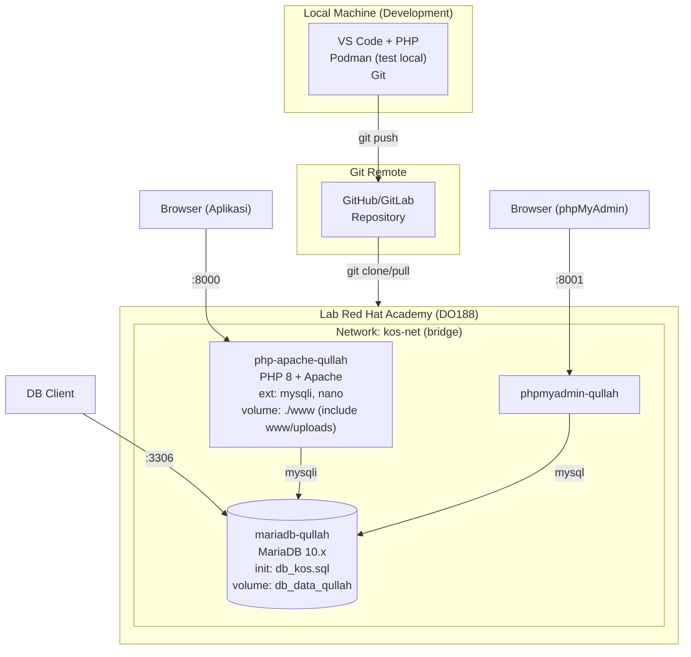

### 9.2 Spesifikasi Services

| Service | Base Image | Port Host->Container | Volume | Depends On |
|---------|-----------|---------------------|--------|-----------|
| `mariadb-qullah` | `mariadb:10` (custom) | `3306:3306` | `db_data_qullah -> /var/lib/mysql` | - (jalankan pertama) |
| `php-apache-qullah` | `php:8-apache` (custom) | `8000:80` | **1 bind mount** `./www -> /var/www/html` (folder `www/uploads/` otomatis tercakup di dalamnya) | `mariadb-qullah` |
| `phpmyadmin-qullah` | `phpmyadmin/phpmyadmin` | `8001:80` | - | `mariadb-qullah` |

### 9.3 Pemenuhan Ketentuan Soal

| Soal | Ketentuan | Cara Pemenuhan |
|------|-----------|---------------|
| 3a | ext mysqli | `RUN docker-php-ext-install mysqli` di php-apache.Containerfile |
| 3b | editor nano | `RUN apt-get install -y nano` di php-apache.Containerfile |
| 4 | import SQL saat init | `COPY db_kos.sql /docker-entrypoint-initdb.d/` di mariadb.Containerfile |
| 5a | volume DocumentRoot | `./www:/var/www/html` (1 bind mount, include subfolder `uploads/`) |
| 5a | port 8000 | `ports: ["8000:80"]` |
| 5b | volume DB permanen | named volume `db_data_qullah` |
| 5b | port 3306 | `ports: ["3306:3306"]` |
| 5c | port 8001 | `ports: ["8001:80"]` |
| 5 | MariaDB jalan dulu | `depends_on` |
| **9** | **homepage tampil seluruh data tabel** | **Default view = tabel HTML 9 kolom kos (id, nama, alamat, tipe, harga, jumlah, status, foto, created_at); konsisten dengan phpMyAdmin Browse tabel kos (Soal 8)** |

---

## 10. Variabel Lingkungan Database

```yaml
MARIADB_ROOT_PASSWORD: rootpass123
MARIADB_DATABASE: db_kos
MARIADB_USER: kos_user
MARIADB_PASSWORD: kos_pass123
```

---

## 11. Workflow Development (Local -> Git -> VPS)

### 11.1 Diagram Workflow

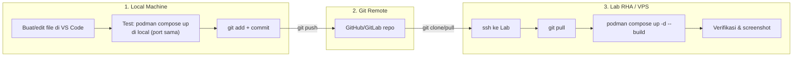

### 11.2 Tahapan Detail

#### Tahap A - Setup Sekali (Local)

```bash
# 1. Buat repo Git
cd ~/uas-qullah
git init
git remote add origin https://github.com/USERNAME/uas-qullah.git

# 2. Buat .gitignore (jangan commit uploads/ dan .env)
cat > .gitignore << EOF
uploads/*
!uploads/default.jpg
.env
*.log
EOF

# 3. Initial commit
git add .
git commit -m "Init: struktur dasar aplikasi kos"
git push -u origin main
```

#### Tahap B - Development Loop (Local)

```bash
# Edit file di VS Code
code .

# Test di local (butuh Podman/Podman Desktop terinstall)
podman compose up -d --build

# Buka http://localhost:8000 -> test fitur
# Setelah oke:
git add .
git commit -m "feat: tambah fitur upload foto kos"
git push
```

#### Tahap C - Deploy ke Lab RHA

```bash
# Login ke Lab RHA via SSH (sesuai akun DO188)
ssh student@lab-rha.example.com

# Clone repo (sekali pertama)
git clone https://github.com/USERNAME/uas-qullah.git
cd uas-qullah

# Update (setiap ada perubahan dari local)
git pull

# Build & run
podman compose up -d --build

# Verifikasi & screenshot (lihat bab 14-15)
```

### 11.3 Tips Workflow

| Aspek | Tips |
|-------|------|
| **.gitignore** | Jangan commit folder `uploads/` (isi foto user) tapi commit `uploads/default.jpg`. Jangan commit password di `.env` jika ada. |
| **Branching** | Untuk tugas ini, main branch saja cukup. Tapi jika mau rapi: branch `develop` untuk eksperimen, `main` untuk stabil. |
| **Secrets** | Password DB ada di `compose.yml`. Jika repo public, pertimbangkan pakai Podman secrets atau environment file yang di-gitignore. |
| **Sinkronisasi** | Selalu `git pull` di Lab sebelum `podman compose up` agar dapat versi terbaru. |

---

## 12. Deliverables (File yang Akan Dibuat)

| Path | Keterangan | Soal |
|------|-----------|------|
| `PRD_Manajemen_Kos_Kosan.md` | Dokumen ini | - |
| `README.md` | Cara setup & run | - |
| `.gitignore` | File yang diabaikan Git | - |
| `db_kos.sql` | DDL (3 tabel + FK) + DML (seed data) | no. 2 |
| `php-apache.Containerfile` | Image PHP-Apache custom | no. 3 |
| `mariadb.Containerfile` | Image MariaDB custom | no. 4 |
| `compose.yml` | Definisi 3 services | no. 5 |
| `www/koneksi.php` | Koneksi database | no. 1 |
| `www/auth.php` | Helper cek session admin | B1 |
| `www/index.php` | Homepage + search/filter | no. 1 + B2 |
| `www/detail.php` | Detail kos + foto + JOIN daftar penyewa | B3 + nilai tambah |
| `www/login.php` | Form login admin | B1 |
| `www/logout.php` | Logout | B1 |
| `www/style.css` | Custom CSS variables (palette aksen, tweak Bootstrap) | no. 1 |
| `www/uploads/default.jpg` | Placeholder foto | B3 |
| `www/admin/dashboard.php` | Dashboard admin | B1 |
| `www/admin/tambah_kos.php` | Form tambah kos + upload foto | no. 1 + B3 |
| `www/admin/edit_kos.php` | Form edit kos | no. 1 |
| `www/admin/hapus_kos.php` | Hapus kos | no. 1 |
| `www/admin/penyewa.php` | Daftar penyewa | B4 |
| `www/admin/tambah_penyewa.php` | Form tambah penyewa | B4 |
| `www/admin/edit_penyewa.php` | Form edit penyewa | B4 |
| `www/admin/hapus_penyewa.php` | Hapus penyewa | B4 |
| `www/flash.php` | Helper flash message (set_flash + show_flash) | - |
| `www/admin/kategori.php` | Daftar kategori keuangan (filter tipe) | B5 |
| `www/admin/tambah_kategori.php` | Form tambah kategori | B5 |
| `www/admin/edit_kategori.php` | Form edit kategori | B5 |
| `www/admin/hapus_kategori.php` | Hapus kategori (dengan BR-9 pre-check) | B5 |
| `www/admin/pendapatan.php` | Daftar pendapatan + filter bulan/tahun | B5 |
| `www/admin/tambah_pendapatan.php` | Form tambah pendapatan (dropdown kos + kategori filter) | B5 |
| `www/admin/edit_pendapatan.php` | Form edit pendapatan | B5 |
| `www/admin/hapus_pendapatan.php` | Hapus pendapatan | B5 |
| `www/admin/pengeluaran.php` | Daftar pengeluaran + filter bulan/tahun | B5 |
| `www/admin/tambah_pengeluaran.php` | Form tambah pengeluaran | B5 |
| `www/admin/edit_pengeluaran.php` | Form edit pengeluaran | B5 |
| `www/admin/hapus_pengeluaran.php` | Hapus pengeluaran | B5 |
| `www/admin/laporan.php` | Laporan keuangan bulanan (stat card + breakdown + chart opsional) | B5 |

---

## 13. Rencana Verifikasi (Soal no. 6-11)

| Soal | Verifikasi | Ekspektasi |
|------|-----------|-----------|
| **6** | `podman compose up -d --build` | 3 container running di background |
| **7** | `podman ps -a` | Status running/stopped terlihat |
| **8** | Buka `http://localhost:8001` | phpMyAdmin login -> lihat tabel `kos` + data awal |
| **9** | Buka `http://localhost:8000` | Homepage menampilkan tabel kos + 2 data awal |
| **10** | Tambah -> Edit -> Hapus via UI admin | Operasi CRUD terverifikasi (login dulu -> admin) |
| **11** | `podman compose down` | Semua container berhenti |

---

## 14. Panduan Screenshot per Soal (no. 1-11)

### SS-01: Struktur File & Source Code (Soal 1, 2, 3, 4, 5)

| Screenshot | Cara Ambil | Elemen Wajib Terlihat |
|------------|-----------|----------------------|
| **SS-01a** Struktur direktori | `tree` atau `ls -R` di terminal | Folder `uas-qullah/` lengkap dengan subfolder `www/`, `www/admin/`, `www/uploads/` |
| **SS-01b** File SQL (soal 2) | Buka `db_kos.sql` di editor | DDL `CREATE DATABASE`, `CREATE TABLE kos`, `CREATE TABLE penyewa` (FK), `CREATE TABLE admin`; DML `INSERT` min 2 record di tabel kos |
| **SS-01c** php-apache.Containerfile (soal 3) | Buka file di editor | `RUN docker-php-ext-install mysqli` + `RUN apt-get install -y nano` |
| **SS-01d** mariadb.Containerfile (soal 4) | Buka file di editor | `COPY db_kos.sql /docker-entrypoint-initdb.d/` |
| **SS-01e** compose.yml (soal 5) | Buka file di editor | 3 services dengan suffix `-qullah`, port 8000/3306/8001, `depends_on`, volume |
| **SS-01f** Aplikasi PHP (soal 1) | Buka `www/index.php`, `admin/tambah_kos.php`, dll | Kode PHP dengan mysqli, query CRUD, form, session check |

### SS-06: Build & Jalankan Container (Soal 6)

| Screenshot | Perintah | Elemen Wajib Terlihat |
|------------|----------|----------------------|
| **SS-06** Output build & up | `podman compose up -d --build` | Log build DONE, container Started, 3 nama service |

### SS-07: Verifikasi Container (Soal 7)

| Screenshot | Perintah | Elemen Wajib Terlihat |
|------------|----------|----------------------|
| **SS-07a** Container running | `podman ps` | 3 baris, STATUS Up, PORTS 8000/3306/8001, NAMES dengan `-qullah` |
| **SS-07b** Semua container | `podman ps -a` | Ketiga container terlihat |

### SS-08: Verifikasi phpMyAdmin (Soal 8)

| Screenshot | URL / Aksi | Elemen Wajib Terlihat |
|------------|-----------|----------------------|
| **SS-08a** Login | `http://localhost:8001` | Halaman login phpMyAdmin |
| **SS-08b** Dashboard | Login `kos_user`/`kos_pass123` | DB `db_kos` terlihat di sidebar |
| **SS-08c** Isi tabel kos | db_kos -> tabel kos -> Browse | 2 record awal terlihat |

### SS-09: Homepage Menampilkan Data (Soal 9)

| Screenshot | URL | Elemen Wajib Terlihat |
|------------|-----|----------------------|
| **SS-09a** Homepage (table view - default) | `http://localhost:8000` | Tabel HTML lengkap dengan **9 kolom** (id, nama_kos, alamat, tipe_kamar, harga_per_bulan, jumlah_kamar, status, foto thumbnail, created_at), 2 record seed data terlihat. Search box + filter (B2). Tombol toggle ke Card View terlihat. |
| **SS-09b** Homepage (card view - after toggle) | Klik toggle "Card View" | Grid kartu kos dengan foto besar + nama + harga + status. Buktikan toggle berfungsi. |
| **SS-09c** Detail kos + JOIN penyewa (nilai tambah) | `http://localhost:8000/detail.php?id=1` | Foto besar kos Melati Jaya + semua field kos + **daftar penyewa** (Andi Pratama) hasil JOIN. Bukti relasi FK 1:N bekerja. |

### SS-10: Verifikasi CRUD (Soal 10)

| Screenshot | Aksi | Elemen Wajib Terlihat |
|------------|------|----------------------|
| **SS-10a** Login admin | `http://localhost:8000/login.php` | Form login (fitur B1 terlihat) |
| **SS-10b** CREATE - Form tambah | Login -> klik Tambah Kos | Form dengan input file foto (B3) |
| **SS-10c** CREATE - Hasil | Submit -> lihat dashboard | Record baru dengan foto muncul |
| **SS-10d** UPDATE - Form edit | Klik Edit | Form terisi pre-fill |
| **SS-10e** UPDATE - Hasil | Submit | Data berubah |
| **SS-10f** DELETE - Konfirmasi | Klik Hapus | Dialog confirm() |
| **SS-10g** DELETE - Hasil | OK | Record berkurang |
| **SS-10h** BR-4 - Hapus kos berpenyewa (nilai tambah) | Klik Hapus pada kos yang masih ada penyewa (mis. kos id=1) | Pesan "Tidak bisa menghapus kos ini karena masih ada N penyewa" — bukti BR-4 RESTRICT pre-check bekerja |
| **SS-10i** Penyewa - Daftar (B4) | Klik Kelola Penyewa | Tabel daftar penyewa dengan JOIN nama kos (relasi FK terlihat) |
| **SS-10j** Penyewa - CREATE (B4) | Klik Tambah Penyewa | Form tambah penyewa dengan dropdown pilih kos (FK) |
| **SS-10k** Penyewa - UPDATE (B4) | Klik Edit Penyewa | Form edit terisi pre-fill, dropdown kos terselect |
| **SS-10l** Penyewa - DELETE (B4) | Klik Hapus Penyewa -> OK | Penyewa berkurang dari daftar |
| **SS-10m** Kategori - Daftar (B5) | Klik Kelola Kategori | Tabel kategori dengan badge tipe (Pendapatan/Pengeluaran), seed default terlihat (Sewa, Listrik, dll) |
| **SS-10n** Kategori - CREATE (B5) | Klik Tambah Kategori | Form tambah kategori (nama + radio tipe) |
| **SS-10o** Kategori - BR-9 demo | Coba hapus kategori "Sewa" yang masih dipakai transaksi | Pesan tolak "Kategori masih dipakai N transaksi" (bukti BR-9 pre-check) |
| **SS-10p** Pendapatan - Daftar (B5) | Klik Kelola Pendapatan | Tabel transaksi pendapatan + filter bulan/tahun, JOIN nama kos & kategori terlihat |
| **SS-10q** Pendapatan - CREATE (B5) | Klik Tambah Pendapatan | Form: dropdown kos + dropdown kategori (filter Pendapatan) + tanggal + jumlah + keterangan |
| **SS-10r** Pengeluaran - CREATE (B5) | Klik Tambah Pengeluaran | Form sama dengan pendapatan tapi kategori filter Pengeluaran |
| **SS-10s** Laporan Keuangan (B5 - nilai tambah) | Klik Laporan Keuangan, pilih bulan Agustus 2026 | 3 stat card (Pendapatan, Pengeluaran, Saldo) + tabel breakdown per kategori + (opsional) chart |

### SS-11: Stop Container (Soal 11)

| Screenshot | Perintah | Elemen Wajib Terlihat |
|------------|----------|----------------------|
| **SS-11a** Stop | `podman compose down` | Log stopping/removing |
| **SS-11b** Verifikasi | `podman ps -a` | STATUS Exited |

### Ringkasan: 36 screenshot (SS-01a s/d SS-11b)

---

## 15. Urutan Eksekusi Lengkap

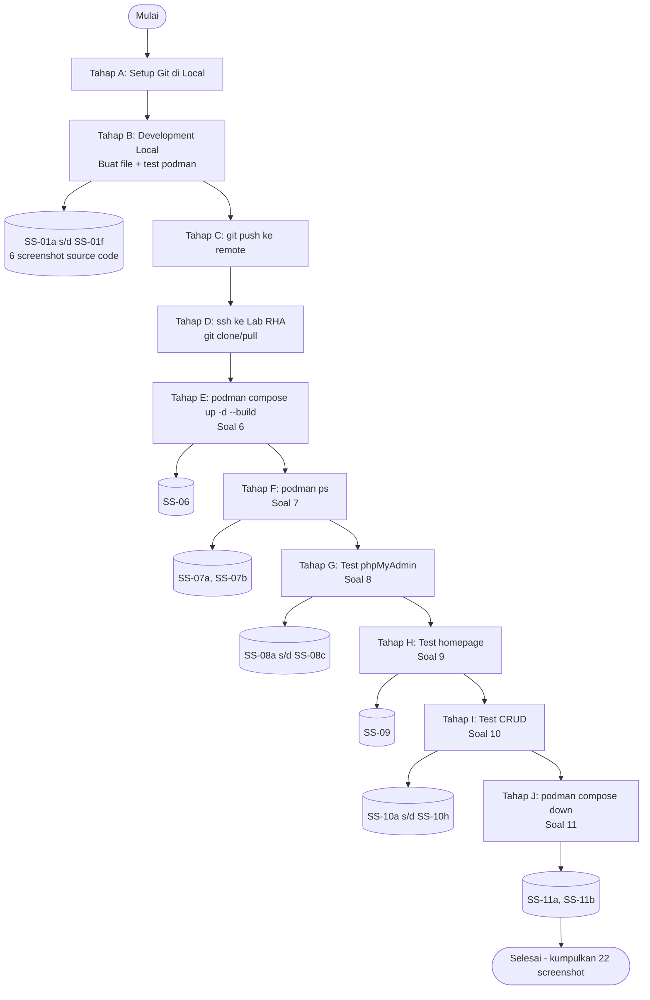

---

## 16. Risiko & Asumsi

| Risiko | Mitigasi |
|--------|---------|
| Port 8000/8001/3306 dipakai | Cek `ss -tlnp` sebelum up |
| Data seed tidak ke-load | Pastikan `db_kos.sql` di `/docker-entrypoint-initdb.d/` |
| Koneksi PHP->DB gagal | Cek service name `mariadb-qullah` di `koneksi.php` |
| Folder `uploads/` tidak writable | `chmod 755 www/uploads` (karena pakai 1 bind mount `./www`, folder `www/uploads/` otomatis ada di container di `/var/www/html/uploads/`; tidak perlu label `:Z` terpisah) |
| Upload foto gagal | Cek `php.ini` upload_max_filesize (2MB default) |
| Session hilang saat restart | Normal - session disimpan di container, reset tiap rebuild |
| Lab RHA sesi habis | Selalu `git push` dari local agar kode tidak hilang |
| Repo public + password di compose.yml | Pakai private repo ATAU Podman secrets |

**Asumsi:**
- Local machine terinstall Podman/Podman Desktop + Git
- Akun GitHub/GitLab tersedia
- Akses Lab RHA via SSH aktif
- Koneksi internet stabil untuk pull image & git

---

## 17. Status Review

- [x] Stakeholder & Actor didefinisikan (5 actor: Admin, Tamu, Browser, DB, Git, Podman)
- [x] Use Case Diagram & deskripsi (13 UC: 3 public + 2 auth + 5 admin CRUD + 4 admin keuangan)
- [x] ERD 6 entitas (kos, penyewa, admin, kategori, pendapatan, pengeluaran) dengan relasi FK
- [x] Sequence Diagram (8 skenario)
- [x] Aturan bisnis (9 BR, BR-4 = RESTRICT + pre-check, BR-8 = validasi transaksi, BR-9 = kategori tidak bisa dihapus jika dipakai)
- [x] Workflow Git (Local -> Remote -> Lab RHA)
- [x] Panduan screenshot (36 screenshot)
- [x] Urutan eksekusi lengkap
- [x] Nama panggilan final: `qullah`
- [x] **Soal 9 compliance: homepage default tabel 9 kolom + toggle card view (v2.1)**
- [x] **Seed data penyewa 2 record + FK menyebar (v2.1)**
- [x] **Detail kos + JOIN penyewa (nilai tambah relasi, v2.1)**
- [x] **CRUD penyewa lengkap di screenshot plan (v2.1)**
- [x] **Konsistensi path uploads = 1 bind mount (v2.1)**
- [x] **Panduan styling profesional Bootstrap 5 + no emoji di UI (v2.2)**
- [x] **Modul manajemen keuangan: kategori custom + pendapatan + pengeluaran + laporan bulanan (v3.0)**
- [x] **Panduan styling profesional Bootstrap 5 + no emoji di UI (v2.2)**
- [x] Urutan eksekusi lengkap
- [x] Nama panggilan final: `qullah`
- [ ] Persetujuan untuk lanjut ke implementasi file

---

## Riwayat Revisi

| Versi | Tanggal | Perubahan |
|-------|---------|-----------|
| v1.0 | 05-Agu-2026 | Initial PRD (1 tabel kos, scope dosen saja) |
| v1.1 | 05-Agu-2026 | Tambah Actor, Use Case, ERD, Sequence Diagram ASCII |
| v1.2 | 06-Agu-2026 | Hapus emoji, konversi ke Mermaid, tambah sequence shutdown |
| v1.3 | 06-Agu-2026 | Tambah panduan screenshot & urutan eksekusi |
| v2.0 | 06-Agu-2026 | **MAJOR: Expand scope (4 fitur tambahan: login, search, upload foto, penyewa); ERD jadi 3 tabel dengan FK; tambah workflow Git (local -> GitHub -> Lab RHA); tambah actor Tamu; struktur folder dengan area admin; 22 file PHP** |
| v2.1 | 10-Agu-2026 | **Fix Soal 9 compliance: homepage default = tabel HTML 9 kolom (semua kolom kos) + toggle card view via JS; truncate alamat + tooltip; SS-09 dipecah jadi SS-09a (table) + SS-09b (card); tambah SS-09c detail kos + JOIN penyewa. Fix konsistensi: seed penyewa jadi 2 record + FK menyebar; BR-4 final = RESTRICT + PHP pre-check dengan pesan ramah; UC4 update flow pre-check + flash message; konsistensi path uploads = 1 bind mount (uploads dalam www); volume DB rename db_data -> db_data_qullah; SS-10 expand: hapus kos berpenyewa (BR-4 demo) + CRUD penyewa lengkap (SS-10h s/d SS-10l); total screenshot jadi 28** |
| v2.2 | 10-Agu-2026 | **Tambah section 8.3 Panduan Styling profesional Bootstrap 5: iron rule NO EMOJI di UI (pakai Bootstrap Icons), color palette netral + 1 aksen, format mata uang/tanggal, flash message, komponen UI spesifik (tabel/card/badge/form), layout principles, anti-patterns yang dilarang. Update deliverables style.css.** |
| v3.0 | 10-Agu-2026 | **MAJOR: Tambah modul manajemen keuangan kos (B5): 3 entity baru (kategori custom dengan tipe Pendapatan/Pengeluaran, pendapatan FK ke kos+kategori, pengeluaran FK ke kos+kategori); ERD 3 -> 6 entitas; UC6-UC9 (CRUD kategori, pendapatan, pengeluaran, laporan bulanan); BR-8 (validasi transaksi >0), BR-9 (kategori tidak bisa dihapus jika dipakai transaksi); 2 sequence diagram baru (input transaksi + laporan); 13 file PHP baru (4 kategori + 4 pendapatan + 4 pengeluaran + 1 laporan + helper flash); seed 10 kategori default + 2 pendapatan + 2 pengeluaran; SS-10m s/d SS-10s untuk modul keuangan; total screenshot 28 -> 36; styling stat card untuk dashboard & laporan.** |

---

> **Catatan untuk dosen:** Topik "Manajemen Kos-Kosan" dipilih karena relevan dengan kebutuhan lokal dan unik. Selain memenuhi 11 ketentuan soal (lapis A), aplikasi ini dilengkapi fitur tambahan (lapis B): autentikasi admin, pencarian/filter, upload foto, dan manajemen penyewa - untuk mendemonstrasikan pemahaman PaaS berbasis container yang lebih komprehensif. Workflow development menggunakan Git untuk sinkronisasi antara local machine dan Lab Red Hat Academy.
